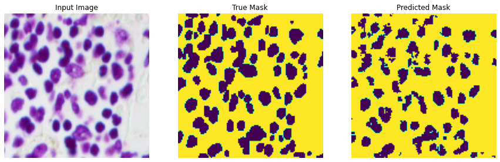

# Cell Neuclei Detection using Semantic Segmentation with U-Net

## Hardware Specifications
AMD Ryzen 7 3700x

NVIDIA Geforce RTX 3050

32GB 3200MHZ DDR4

## 1. Summary
The aim of the project is to detect cell nuclei from biomedical images effectively. As cell nuclei vary in shapes and sizes, semantic segmentation proves to be the best approach to detect them. A deep learning model is trained and deployed for this task. The model is trained with the well known [2018 Data Science Bowl dataset](https://www.kaggle.com/c/data-science-bowl-2018).

## 2. IDE and Framerowk
The project is built with Spyder 5.3.1 as the main IDE. The main frameworks used in this project are TensorFlow, Numpy, Matplotlib, OpenCV and Scikit-learn.

## 3. Methodology
The methodology is inspired by a documentation available in the official TensorFlow website. You can refer to the documentation [here](https://www.tensorflow.org/tutorials/images/segmentation).

### 3.1. Input Pipeline
The dataset files contains a train folder for training data and test folder for testing data, in the format of images for inputs and image masks for the labels. The input images are preprocessed with feature scaling. The labels are preprocessed such that the values are in binary of 0 and 1. No data augmentation is applied for the dataset. The train data is split into train-validation sets, with a ratio of 80:20

### 3.2. Model Pipeline
The model architecture used for this project is U-Net. You can refer to the TensorFlow documentation for further details. In summary, the model consist of two components, the downward stack, which serves as the feature extractor, and upward stack, which helps to produce pixel-wise output. The model structure is shown in the figure below.

The model is trained with a batch size of 128 and 200 epochs. Early stopping is also applied in the model training. The training stops at epoch 60, with a training accuracy of 97% and validation accuracy of 95%. The model training graphs are shown in figures below.

 

The graphs show a clear sign of model convergence at an excellent convergence point.

## 4. Results
The model is evaluated with test data, which is shown in figure below.

Some predictions are also made with the model using some of the test data. The actual output masks and prediction masks are shown in figures below.

Overall, the model is capable of segmenting the cell neuclei with an excellent accuracy.